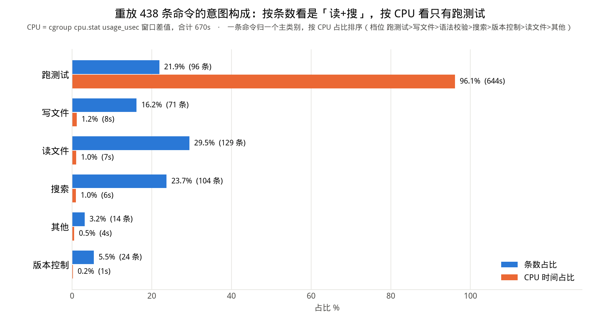
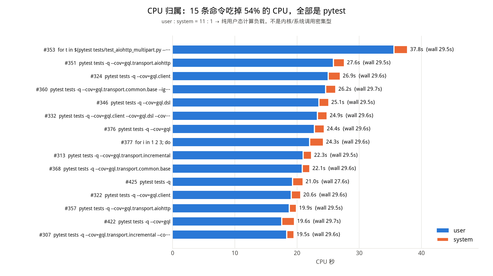
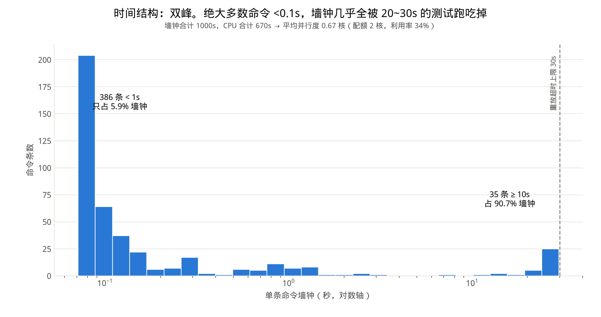

# 容器重放负载画像：`gql-incremental-graphql-delivery__nnFNKRL`

**一句话结论**：这是一份**纯用户态、CPU 单点集中、几乎不碰块设备**的负载——
438 条命令里 96 条跑测试，吃掉 **96.1% 的 CPU**；top 15 条命令就占 **54.1%**；
user : system = **10.7 : 1**；438 条里只有 28 条产生过块层读，全部集中在"第一次碰"的时刻。
拿它当处理器负载，**得到的是 Python 解释器 + pytest 的用户态计算，不是 IO 负载**。

数据：`deepswe/replay_out/gql-incremental-graphql-delivery__nnFNKRL/commands.jsonl`（438 条）
复算：`python3 deepswe/summarize_replay.py`（加 `--audit` 逐条看分类，加 `--charts` 出图）
本文每个数字都来自这条命令的输出；`--json` 可导出机器可读快照。

---

## 0. 计量口径（先说清楚，否则下面的数字会被误读）

重放由 `deepswe/replay.py` 完成：**一个长驻容器 + 串行 `docker exec`**，容器限 `cpus=2 mem=8192MB net=none`，
单条命令超时 30s（容器内 `timeout -k 5 30`）。每条命令前后各采一次宿主侧 cgroup 文件，取差值：

| 字段 | 来源 | 要注意什么 |
|---|---|---|
| `user_usec` / `system_usec` / `usage_usec` | `cpu.stat` 窗口差值 | 是**整个容器 cgroup** 的，不是单进程 |
| `rbytes` / `wbytes` | `io.stat` 窗口差值 | **块层**字节，不是 `read(2)/write(2)` 计数；命中 page cache 不计入 |
| `mem_peak` | 后台 20ms 轮询 `memory.current` 取窗口最大值 | 本机 5.15 内核没有 `memory.peak`；**含 page cache**，是容器级水位不是进程 RSS |
| `wall_s` | 宿主侧 `docker exec` 墙钟 | 含 exec 建立/回收开销 |
| `trace_rc` | 原始 trajectory 里该步的返回码 | 与 `rc` 比对即保真度 |

合计：墙钟 **999.6s**，CPU **669.9s**（user 612.5s + system 57.3s）。

---

## 1. 命令意图分布：按条数是"读+搜"，按 CPU 只有"跑测试"



| 类别 | 条数 | 条数占比 | CPU 秒 | CPU 占比 | 墙钟秒 | 墙钟占比 | user/sys |
|---|---:|---:|---:|---:|---:|---:|---:|
| 跑测试 | 96 | 21.9% | 643.8 | **96.1%** | 955.9 | 95.6% | 11.6 |
| 写文件 | 71 | 16.2% | 7.9 | 1.2% | 9.0 | 0.9% | 4.4 |
| 搜索 | 104 | 23.7% | 6.4 | 1.0% | 8.9 | 0.9% | 2.7 |
| 版本控制 | 24 | 5.5% | 1.4 | 0.2% | 2.2 | 0.2% | 1.9 |
| 读文件 | 129 | **29.5%** | 6.9 | 1.0% | 12.0 | 1.2% | 2.9 |
| 其他 | 14 | 3.2% | 3.5 | 0.5% | 11.7 | 1.2% | 3.5 |
| **合计** | **438** | 100% | **669.9** | 100% | **999.6** | 100% | 10.7 |

**两个口径完全不是一回事**：
「读文件 + 搜索」233 条（53.2% 的条数）只烧掉 13.3s CPU（**2.0%**）；
「跑测试」96 条（21.9% 的条数）烧掉 643.8s（**96.1%**）。
按每条命令的平均 CPU 算：跑测试 **6.71 s/条**，读+搜 **0.057 s/条**，**相差 117 倍**。
所以"agent 干了什么"和"机器忙什么"是两张完全不同的图。

### 分类规则（可复现，不是拍脑袋）

`cd /app &&` 已被 `cmd_stripped` 剥掉，分类只看**真正被执行的程序名**，不做关键字正则计数——
因为 **90 条命令带 heredoc**（64 条 `python3 - <<EOF`、27 条 `cat > f <<EOF`），正文里全是
`pytest` / `sleep` / `>` 这类词，正则会把"写测试文件"算成"跑测试"。
脚本先做 heredoc / 引号感知的切分（`split_statements`），再逐语句取程序名：

1. **管道由管道头定意图**：`pip list | grep x` 是环境查询不是搜索；`git status | head` 是版本控制不是读文件。
   例外是管道头本身只喂文本（`cat` / `nl` / `sed -n` / `ls` / `echo` / `git diff|show|log`），这时看下游第一个非查看类程序，
   于是 `git diff --cached | grep "pragma"` 判成搜索。
2. **一条命令一个主类别**，取档位最高的那条语句。档位：
   `跑测试 > 写文件 > 跑测试[语法校验] > 搜索 > 版本控制 > 读文件 > 其他`。
   语法校验（`python3 -c "import ast; ast.parse(...)"`）单独降到写文件之后——它在这条 trace 里几乎总是
   紧跟一次编辑当护栏，那条命令的正事是改文件。
3. `python3 -c` / `python3 - <<EOF` 的正文按序判：写文件标记 → `ast.parse`/`compile()` → `inspect.getsource`
   → 只读打开+正则扫描 → 构造对象/调用函数 → 其余（只 import+print 属性）。

**143 条命令（32.6%）混了多种意图**，都按上面的档位归了单一主类别。`--audit` 逐条打印
`i / 主类别 / 命中的类别集合 / 细类 / 命令首行`，438 行全可人工核对。

### 细类（不重叠划分）

| 细类 | 条数 | CPU 秒 | CPU 占比 |
|---|---:|---:|---:|
| pytest | 68 | 624.3 | 93.2% |
| 复现脚本（`python3 /tmp/test_repro_*.py`） | 7 | 15.1 | 2.2% |
| python 改文件（heredoc 里 `open(path,"w")`） | 44 | 5.5 | 0.8% |
| grep | 80 | 4.8 | 0.7% |
| 内联脚本验证 | 11 | 2.9 | 0.4% |
| nl | 49 | 2.7 | 0.4% |
| sed 取行段 | 47 | 2.0 | 0.3% |
| heredoc 写文件（`cat > f <<EOF`） | 20 | 1.9 | 0.3% |
| 接口探查（`python3 -c "import graphql; print(...)"`） | 11 | 1.9 | 0.3% |
| 环境查询（pip） | 3 | 1.6 | 0.2% |
| 语法/编译校验 | 10 | 1.5 | 0.2% |
| 读库源码（`inspect.getsource`） | 4 | 1.1 | 0.2% |
| cat | 22 | 0.9 | 0.1% |
| 脚本扫文件 | 3 | 0.7 | 0.1% |

> 口径说明：`awk '{if (length($0) > 88) print ...}'` 算**搜索**——它是在扫文件找超长行，形态上就是带条件的 grep。
> 全文有 13 条命令用到 awk，其中 8 条的主类别就是它（另外 5 条里 awk 只是某条语句，主类别被更高档位拿走）。

---

## 2. CPU 归属：15 条命令 = 54.1%，而且全是 pytest



| # | user_s | sys_s | wall_s | u/s | 累计 CPU% | 命令 |
|---:|---:|---:|---:|---:|---:|---|
| 353 | 35.6 | 2.2 | 29.5 | 16.2 | 5.6% | `for t in $(pytest tests/test_aiohttp_multipart.py --collect-only -q …` |
| 351 | 25.8 | 1.8 | 29.5 | 14.4 | 9.8% | `timeout 90 pytest tests -q --cov=gql.transport.aiohttp …` |
| 324 | 25.0 | 1.9 | 29.6 | 12.9 | 13.8% | `timeout 90 pytest tests -q --cov=gql.client …` |
| 360 | 24.6 | 1.6 | 29.7 | 14.9 | 17.7% | `timeout 90 pytest tests -q --cov=gql.transport.common.base …` |
| 346 | 23.5 | 1.6 | 29.5 | 14.7 | 21.5% | `timeout 90 pytest tests -q --cov=gql.dsl …` |
| 332 | 23.3 | 1.6 | 29.6 | 14.9 | 25.2% | `timeout 90 pytest tests -q --cov=gql.client --cov=gql.dsl …` |
| 376 | 22.8 | 1.6 | 29.6 | 14.2 | 28.8% | `timeout 90 pytest tests -q --cov=gql …` |
| 377 | 22.0 | 2.2 | 29.6 | 9.9 | 32.4% | `for i in 1 2 3; do … pytest tests -q … done` |
| 313 | 21.0 | 1.4 | 29.5 | 15.4 | 35.8% | `timeout 90 pytest tests -q --cov=gql.transport.incremental …` |
| 368 | 20.8 | 1.2 | 29.6 | 16.8 | 39.1% | `timeout 90 pytest tests -q --cov=gql.transport.common.base …` |
| 425 | 19.3 | 1.7 | 27.6 | 11.5 | 42.2% | `timeout 90 pytest tests -q 2>&1 \| tail -10` |
| 322 | 19.1 | 1.5 | 29.6 | 12.6 | 45.3% | `timeout 90 pytest tests -q --cov=gql.client …` |
| 357 | 18.7 | 1.2 | 29.5 | 15.9 | 48.2% | `timeout 90 pytest tests -q --cov=gql.transport.aiohttp …` |
| 422 | 17.6 | 2.1 | 29.7 | 8.5 | 51.2% | `timeout 90 pytest tests -q --cov=gql …` |
| 307 | 18.3 | 1.2 | 29.6 | 15.6 | 54.1% | `timeout 90 pytest tests -q --cov=gql.transport.incremental --cov=gql.dsl …` |

集中度：**top15 = 54.1%，top30 = 83.5%，top50 = 92.8%**（438 条里的 50 条）。

**15 条里 13 条带 `--cov`。** 同一套 `pytest tests -q`，两种跑法差别极大：

| 跑法 | 条数 | wall | CPU 中位 | 是否跑完 |
|---|---:|---|---:|---|
| 不带 `--cov` | 15 | 23.10 ~ 27.61s | **12.43s**（15 条里 14 条 ≤14.5s） | 全部跑完 |
| 带 `--cov` | 13 | 29.48 ~ 29.68s | **22.35s**（19.4 ~ 27.6s） | **全部被 30s 砍断，一条都没跑完** |

CPU 中位比 = 22.35 / 12.43 = **1.8 倍，而且这是下界**（分子那边还没跑完）。
**覆盖率插桩是这份负载 CPU 榜单的主要塑形者**——榜单前 15 名里 13 条是它。

### user vs system 说明这是什么负载

全局 **user 612.5s / system 57.3s = 10.7 : 1**（user 91.4%，sys 8.6%）；
CPU top15 单条的 u/s 在 **8.5 ~ 16.8**。

含义：**这是纯用户态的解释执行负载**——Python 字节码解释、import 时的编译与对象构造、
coverage 的行级 trace 回调，全在用户态烧。内核侧只有进程创建、页错误、管道/文件描述符这些零头。
所以它压的是**单核标量性能 + 分支预测 + L1/L2 与内存带宽**，不压 IO 栈、不压调度器、不压 syscall 路径。
反过来说：拿这份重放去评测"系统调用吞吐/IO 栈"是选错了负载。

按类别看 user/sys 也一致：跑测试 11.6、写文件 4.4、搜索 2.7、读文件 2.9、版本控制 1.9——
**越是短命令，system 占比越高**，因为那点 CPU 里很大一块是进程创建本身。

---

## 3. IO：几乎没有块层 IO，因为 page cache 全接住了

`rbytes` 非零 **28/438**（合计 97.1 MB），`wbytes` 非零 **135/438**（合计 27.0 MB）。

**为什么读这么少——不是没读文件，是没读到磁盘。** 证据在时间顺序上非常干净：

| 事件 | 命令 | rbytes |
|---|---|---:|
| 第一次跑 python 并 import graphql | i=18 | 8.42 MB |
| 第一次 `pip install --dry-run`（读 pip 自己的元数据/wheel） | i=80 | **50.82 MB** |
| 第一次 `pytest -x` | i=82 | 5.84 MB |
| 第二次 pytest（第一次跑完整套） | i=83 | 15.45 MB |
| 其后 66 次 pytest | i≥84 | 大多为 **0** |

- **读字节 top3 占总读的 76.9%**，全部是"第一次碰"。
- 按类别：**读文件类 129 条里 rbytes 非零只有 2 条，wbytes 非零 0 条**；
  搜索类 104 条里 rbytes 非零 4 条。也就是说 `cat` / `nl` / `sed -n` / `grep` 这 233 条命令，
  **几乎全部命中 page cache**，块层看不到它们。
- pytest 细类 68 条中，rbytes 非零仅 8 条、wbytes 非零 67 条。

机制：容器 `mem=8192MB`，整个仓库 + site-packages 的热数据量（从上表看总读入不到 100 MB）
远小于内存，首次读入后就常驻 page cache，后续 `read(2)` 全在内存里完成，`io.stat` 的 rbytes 不增长。

**写的 27.0 MB 是回写（writeback），不是命令的实时写量**：top 写量集中在 pytest 跑（`.pyc` 落盘、
`/tmp/*.log`、coverage 数据）和 `git clean -fdx`（i=434，2.64 MB，删 `__pycache__` 的元数据/日志）。
回写是异步的：命令 N 弄脏的页会在之后某条命令的窗口里才被刷下去，**所以 wbytes 到单条命令的归属是近似的**
（精确归属的做法见文末待验证清单第 3 条）。

### 这对"用重放做处理器负载"意味着什么

1. **重放天然是 CPU/内存负载，不是存储负载。** 想拿它压 IO 子系统，测出来的会是接近 0 的块层流量。
2. **第一条命令和第 100 条命令不可比。** 冷启动那几条（i=18/80/82/83）带着几十 MB 的真实磁盘读，
   之后同类命令全是缓存命中。做跨机器/跨配置对比时，**要么统一预热，要么把前 ~85 条当 warm-up 丢掉**。
3. 想让重放包含真实 IO，只能人为制造：每条命令前 drop caches、给容器更小的内存限制、
   或者换成体积远大于内存的仓库。这三条都会同时改变 CPU 侧的数字，**不是免费的**。
4. 好处一面：正因为没有 IO 抖动，这份负载的**可重复性很好**——不带 `--cov` 跑完整套的 15 次，
   墙钟落在 23.10~27.61s、CPU 中位 12.43s，离散度基本就是解释器本身的抖动。

---

## 4. 内存：mem_peak 主要反映的是"容器水位"，不是"这条命令要多少内存"

分位数（438 条）：

| min | p25 | 中位 | p75 | p90 | p99 | max |
|---:|---:|---:|---:|---:|---:|---:|
| 4.3 MB | 116.2 MB | 119.9 MB | 212.0 MB | 253.9 MB | 305.7 MB | **328.0 MB** |

峰值最高的命令：**i=324，328.0 MB**，`timeout 90 python3 -m pytest tests -q --cov=gql.client --cov-report=term-missing`
（wall 29.6s，1449 个采样点）。前 8 名里 7 条是 pytest，第 5 名 i=342 是只跑 1.46s 的
`pytest tests/starwars/test_dsl.py -k "stream or defer"`，也报到 306.3 MB。

**口径的局限（这是本节最重要的一句）**：`mem_peak` 取的是 `memory.current` 的窗口最大值，
而 `memory.current` 是**整个容器 cgroup 的当前用量，包含 page cache**。所以：

- **只读类命令（129 条 cat/nl/sed，进程 RSS 至多几 MB）的 mem_peak 中位数是 116.3 MB。**
  这 116 MB 不是它们用的，是容器里躺着的缓存。
- 时间上能看到明显的棘轮：首次 pytest 在 i=82，**之前 82 条的 mem_peak 中位 16.4 MB，
  之后 355 条中位 122.6 MB、最小 113.5 MB**——缓存暖起来就再没跌回去。
- 因此 **pytest 自身的增量约 328.0 − 113.5 ≈ 215 MB**，这个差值比 328 MB 这个绝对值有意义得多。
- 各类别的 mem_peak 最大值几乎一样高（跑测试 328.0 / 搜索 266.2 / 读文件 265.8 / 写文件 265.7 /
  版本控制 257.2 MB）——**这本身就是口径失真的证据**：`grep` 不会用 266 MB，它只是恰好跑在缓存水位高的时刻。
- 采样精度：20ms 轮询，**218 条命令的采样点 ≤5 个**（因为它们只跑 70~200ms）。
  对这些命令，mem_peak ≈ "那一瞬间容器的内存水位"，跟命令自身几乎无关。

**要拿到真实的每命令内存，需要改测法**（待验证，本次没做）：换成 `memory.peak`（需要 ≥6.8 内核）、
每条命令前往 `memory.reclaim` 写字节数压掉缓存、或者改用 `/proc/<pid>/status` 的 `VmHWM` 按进程树统计。

---

## 5. 时间结构：双峰，2 核只用掉三分之一



wall 分位数：

| min | p25 | 中位 | p75 | p90 | p95 | max |
|---:|---:|---:|---:|---:|---:|---:|
| 0.071s | 0.080s | **0.091s** | 0.171s | 1.330s | 25.570s | 29.678s |

**两个峰，中间是空的**：

- **386 条 < 1s（88.1%），合起来只占 5.9% 墙钟。** 中位数 0.091s ≈ 一次 `docker exec` + 一个短进程的固定开销。
- **35 条 ≥ 10s（8.0%），占 90.7% 墙钟。** 34 条细类就是 `pytest`，
  第 35 条（i=125）是"先跑复现脚本、再跑整套 pytest"那一条。

### 并行度

- **CPU 合计 / 墙钟合计 = 669.9 / 999.6 = 0.670 核。**
- 容器配额 2 核 → 核·秒预算 999.6 × 2 = **1999 核·秒，实际用掉 670，利用率 33.5%，空转 1329 核·秒**。
- 单命令 `cpu/wall`：中位 **0.51**，p90 1.47，max 1.95（i=349）。
  **76 条命令 > 1.05**，即确实同时用到了第二个核。

也就是说：**这份负载给两核，平均只喂饱三分之一个核。** 拿它做处理器负载时，
2 核配额是浪费的；要压满多核，得并行跑多条 trace，而不是指望一条 trace 内部的并行。

> `cpu/wall > 1.05` 的 76 条里，跑测试只有 17 条；另外 59 条全是 **wall ≤ 0.222s**（中位 0.095s）的短命令
> （搜索 22 / 写文件 16 / 读文件 14 / 版本控制 4 / 其他 3）。
> 短命令超过 1 核的直接原因是管道里同时有多个进程（`nl f | sed -n` 就是两个）。
> pytest 长命令能到 1.9 的具体来源（测试里起的服务器进程 / 线程池 / 还是 cgroup 窗口里混进了别的进程）
> **本次没有验证，标记为待验证**。

### 有多少墙钟是"CPU 没干活"

单核口径：`Σ max(0, wall − cpu) = 359.1s，占墙钟 35.9%`。
其中 **326.8s（91%）来自那 35 条 ≥10s 的命令**——测试里的 `asyncio.sleep`、websocket 握手等待、
以及等超时。最极端的三条：

| # | wall | cpu | 空转 | 命令 |
|---:|---:|---:|---:|---|
| 220 | 29.67s | 0.68s | 29.00s | `pytest tests/test_client_incremental.py -q \| tail -150`（挂住，等到被打死） |
| 223 | 15.09s | 0.66s | 14.43s | `timeout 15 pytest …::test_client_execute_incremental_sync -q > /tmp/out.log`（同一个用例改成重定向再看，同样等满 15s） |
| 222 | 15.09s | 0.69s | 14.40s | `timeout 15 pytest …::test_client_execute_incremental_sync -q \| tail`（同一个用例的第一次尝试，等满 15s） |

这三条加起来 59.9s 墙钟只换来 2.0s CPU——**它们是"卡住的测试"，不是负载**。
用重放做处理器负载时，这类命令应当被识别出来单独处理（跳过、或计入"等待"而不是"计算"）。

---

## 6. 与原始 trace 的对照：16 条 rc 不一致，全是重放侧超时

| 类型 | 条数 | i |
|---|---:|---|
| 重放超时 `rc=124`，**原始成功** `trace_rc=0` | 14 | 307, 313, 322, 324, 332, 346, 351, 353, 357, 360, 368, 376, 395, 422 |
| 重放超时 `rc=124`，**原始也超时** `trace_rc=-1` | 2 | 220, 377 |
| 其他原因不一致 | 0 | — |

**原因单一：重放的单命令超时上限（30s）比 trace 自带的 `timeout 90` 更紧。**
这 16 条的 wall 全部落在 **[29.48, 29.68]s**，就是被 `timeout -k 5 30` 打死的形状。

- 那 14 条"原始成功、重放超时"的命令，**全部带 `--cov`**。
  推断链是闭合的：原始环境下它们在 `timeout 90` 内跑完（`trace_rc=0`）→ 真实耗时 < 90s；
  重放里 30s 被砍断 → 真实耗时 > 30s。所以**带 `--cov` 的整套测试真实耗时在 30~90s 之间**，
  而不带 `--cov` 的同一套是 23.10~27.61s。
- 那 2 条（220、377）原始就是 `trace_rc=-1`（原始 harness 的超时编码），重放同样超时，
  **只是超时的编码不同（124 vs −1），行为一致**，不算背离。
  `replay.py` 的 `verdict.json` 因此记 "rc 序列一致 422/438、时序背离 14 条"。

**代价**：这 16 条被截断的命令贡献了 **54.0% 的 CPU**。
所以这次重放测到的 669.9s CPU **是一个下界**——真实负载至少还要多出这些命令被砍掉的那一截。

**保真度本身没问题**：`replayed.patch` 与下载到的 `model.patch` **逐字节一致（均 137,962 B）**，
说明文件状态被完整复现，rc 的差异只发生在超时策略上。

**修法（未执行，留给下一轮）**：把 `--cmd-timeout` 提到 ≥120s，或直接取 trace 里每条命令自带的
`timeout N` 再加余量。改完应当能把 rc 一致率打到 436/438（剩 2 条是原始就超时的）。

---

## 7. 汇总：这份重放当"处理器负载"能用在哪、不能用在哪

**能用**：
- 单核用户态计算负载（Python 解释器 + pytest + coverage 插桩），user 占 91.4%。
- 可重复性好——没有 IO 抖动，不带 `--cov` 跑完整套的 15 次，墙钟 23.10~27.61s、CPU 中位 12.43s。
- 负载里确实包含 agent 的探索过程：438 条里 233 条是读/搜（53.2%），71 条是写文件，
  只是它们对 CPU 的贡献只有 2.0% / 1.2%。

**不能用**：
- 压 IO：438 条里只有 28 条产生块层读，总共 97.1 MB，且 76.9% 集中在 3 条冷启动命令。
- 压多核：平均并行度 0.670 核，2 核配额浪费 66.5%。
- 按 `mem_peak` 谈内存：这个口径含 page cache，只读命令都报 116 MB。
- 当作"完整"负载：16 条命令（54.0% 的 CPU）在 30s 处被砍断，测到的 CPU 是下界。

**要做规模化采集，下一步该动的三件事**（按收益排序）：
1. `--cmd-timeout` 提到 ≥120s——否则 CPU 总量系统性偏低，且偏低的幅度取决于命令跑多久，不是常数。
2. 换 `memory.peak` 或按进程树采 `VmHWM`，否则内存维度的数据没法用。
3. 明确 warm-up 边界（本例是前 ~85 条），跨机器对比时要么统一预热，要么丢掉这一段。

---

## 待验证清单

1. pytest 长命令的 `cpu/wall` 能到 1.9 的来源（测试起的独立进程？线程池？还是 cgroup 窗口混入了别的进程）——本次只测到现象，没定位。
2. 带 `--cov` 的整套测试真实耗时只知道在 30~90s 之间，**确切值需要把超时放宽后重跑一次**。
3. `wbytes` 到单条命令的归属是近似的（回写异步），要精确归属需要在命令边界 `sync` 或改用 per-process IO 计数。
4. 27.0 MB 写里 `.pyc` / `/tmp` 日志 / coverage 数据各占多少，没有拆分。

---

## 附：如何复算本文任一数字

```bash
cd /home/river/projects/agent
python3 deepswe/summarize_replay.py                 # 全部六节，本文所有数字
python3 deepswe/summarize_replay.py --audit         # 438 条逐条分类，核对第 1 节
python3 deepswe/summarize_replay.py --charts        # 三张图
python3 deepswe/summarize_replay.py --json /tmp/p.json   # 机器可读快照

# 单点抽查示例（不依赖脚本）
python3 - <<'PY'
import json
R=[json.loads(l) for l in open("deepswe/replay_out/gql-incremental-graphql-delivery__nnFNKRL/commands.jsonl") if l.strip()]
print(len(R), sum(r["wall_s"] for r in R), sum(r["usage_usec"] for r in R)/1e6)
print(sum(1 for r in R if r["rbytes"]), sum(1 for r in R if r["wbytes"]))
print([r["i"] for r in R if r["rc"]!=r["trace_rc"]])
PY
```

产物：
- `deepswe/summarize_replay.py` — 画像脚本（不改 `replay.py`）
- `deepswe/WORKLOAD_gql-incremental.md` — 本文
- `deepswe/workload_intent_mix.png` / `workload_cpu_top15.png` / `workload_time_structure.png`
- `deepswe/replay_out/gql-incremental-graphql-delivery__nnFNKRL/workload_profile.json` — 机器可读快照
