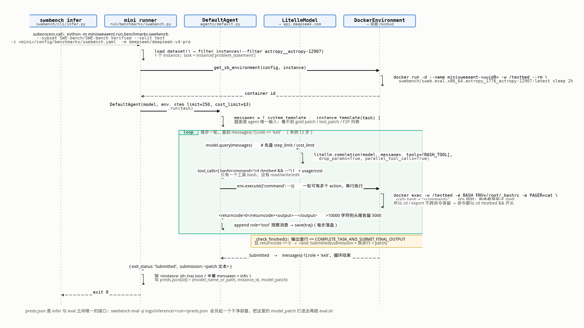

# SWE-bench 推理侧（infer / agent）流程 — 源码级梳理

> SWE-bench 仓库本身**不含 agent**。`swebench infer` 只是一个 argv 组装器，真正干活的是外部包
> mini-SWE-agent（本机 v2.4.6）。本文件讲清楚「一个 task 怎么启动、agent 怎么被调用」。



## 1. `swebench infer` 做的唯一一件事：拼命令行

`swebench/inference/mini_swe_agent.py:build_command()`（纯 argv builder，可单测，不 spawn 任何东西）：

```python
cmd  = [sys.executable, "-m", "minisweagent.run.benchmarks.swebench"]
cmd += ["--subset", <resolve_dataset(alias)>, "--split", split]
cmd += ["-w", workers, "-o", output_dir]
cmd += ["-c", <mini 包内 config/benchmarks/swebench.yaml 的绝对路径>]   # 必须显式传
cmd += ["-c", extra_config...]                                        # 用户追加的
cmd += ["-m", model] + 未识别的参数原样透传
```

两个细节值得注意：
- **必须显式带上 mini 自带的默认 config**：mini 只要看到任何 `-c`，就会丢掉自己的默认配置。
- **别名不走 mini 的表**：mini 自己的 `DATASET_MAPPING` 指向旧的 `princeton-nlp/*` 副本（没有
  `image`/`eval_script` 列）。SWE-bench 这边把别名解析成完整 HF id（`SWE-bench/SWE-bench_Verified`）
  再传给 `--subset`，mini 认不出就当数据集路径直接 `load_dataset`，于是永远拿到新版数据集。

`run()` 就是 `subprocess.call(cmd)`，流式透传输出。**API key 不归 SWE-bench 管**，由 litellm 从环境变量读。

## 2. mini 的批量 runner：`minisweagent/run/benchmarks/swebench.py`

```
main()
 ├─ load_dataset(subset, split)                 # 整个数据集
 ├─ filter_instances(--filter 正则 / --slice / --shuffle)
 ├─ 断点续跑：preds.json 里已有的 instance 直接跳过（除非 --redo-existing）
 ├─ config = recursive_merge(每个 -c 的内容, CLI 覆盖项)
 └─ ThreadPoolExecutor(max_workers=w) 对每个 instance 调 process_instance()
```

`process_instance(instance)` 是**一个 task 的生命周期**：

```
1. 清理残留：从 preds.json 删掉该 id，删掉旧 traj.json
2. model = get_model(config["model"])                  # LitellmModel
3. task  = instance["problem_statement"]               # ← agent 唯一能看到的题面
4. env   = get_sb_environment(config, instance)        # 起容器
5. agent = ProgressTrackingAgent(model, env, **config["agent"])
6. info  = agent.run(task)                             # 主循环
7. finally:
     agent.save(<out>/<instance_id>/<instance_id>.traj.json)   # 全量轨迹
     update_preds_file(<out>/preds.json, instance_id,
                       model_name, info["submission"])         # ← 这就是 model_patch
```

**镜像怎么定的**（`get_swebench_docker_image_name`）：优先 `instance["image_name"]` / `["docker_image"]`，
都没有就按 id 构造 `docker.io/swebench/sweb.eval.x86_64.<id 把 __ 换成 _1776_>:latest`。
新版数据集的列叫 `image`（不叫 `image_name`），所以走的是构造分支——结果字符串与数据集里的 `image` 一致。
**agent 用的镜像和评测用的镜像是同一个**：agent 在 `/testbed` 里改代码，评测再起一个新容器从干净镜像开始，
把 agent 产出的 patch 打进去。两者不共享容器状态。

## 3. 容器：`minisweagent/environments/docker.py`

启动（对象构造时就执行）：
```bash
docker run -d --name minisweagent-<uuid8> -w /testbed --rm \
       swebench/sweb.eval.x86_64.astropy_1776_astropy-12907:latest \
       sleep 2h
```

每执行一个动作：
```bash
docker exec -w /testbed \
  -e PAGER=cat -e MANPAGER=cat -e LESS=-R -e PIP_PROGRESS_BAR=off \
  -e TQDM_DISABLE=1 -e BASH_ENV=/root/.bashrc \
  <container_id> bash -c "<模型给的命令>"
```
- `interpreter: ["bash","-c"]`（非 login shell）⇒ 不会 source `~/.bashrc`，
  所以额外用 `BASH_ENV=/root/.bashrc` 把镜像里的 `conda activate testbed` 拉起来，否则用的是 base 环境。
- **每条命令都是全新子 shell**：`cd`、`export` 不跨命令保留。这就是为什么 prompt 里反复强调
  「Directory or environment variable changes are not persistent」。
- `timeout: 60` 秒，`stderr` 并入 `stdout`，超时算 returncode=-1 并把异常信息回灌给模型。
- 结束条件在 env 层判定：`_check_finished()` 检查输出**第一行**是否恰为
  `COMPLETE_TASK_AND_SUBMIT_FINAL_OUTPUT` 且 returncode==0，是则抛 `Submitted` 异常，
  其余行拼起来就是 `submission`（= patch）。
- `cleanup()` 后台异步 `docker stop || docker rm -f`。

## 4. Agent 主循环：`minisweagent/agents/default.py`

```python
run(task):
    messages = [ system_template , instance_template.render(task=problem_statement) ]
    while True:
        try:
            step()                       # = execute_actions(query())
        except FormatError:              # 模型没给 tool call
            连续 3 次 -> exit RepeatedFormatError
        except InterruptAgentFlow:       # Submitted / LimitsExceeded / TimeExceeded
            append 该 exit 消息
        finally:
            save(traj)                   # 每步都落盘，崩了也有轨迹
        if messages[-1].role == "exit":
            break
    return messages[-1].extra            # {exit_status, submission}

query():
    if n_calls >= step_limit(250) or cost >= cost_limit(3.0): raise LimitsExceeded
    n_calls += 1
    message = model.query(messages)      # litellm.completion(..., tools=[BASH_TOOL])
    cost += message.extra.cost

execute_actions(message):
    for action in message.extra.actions:      # 支持一轮多个 tool call（parallel_tool_calls）
        env.execute(action)                   # docker exec
    append 每个 action 对应的 role="tool" 观察消息
```

整个 agent 只有 **一个工具：`bash`**（`BASH_TOOL`，参数只有 `command` 一个字符串）。
没有专门的 read/write/edit 工具 —— 读文件、改文件、跑测试全部靠模型自己写 shell。
这正是「mini」的含义，也是后面统计 bash 内部操作有意义的原因。

## 5. Prompt 契约（`config/benchmarks/swebench.yaml`）

- system：一句话「你是能操作 shell 的助手」。
- instance：把 `problem_statement` 包进 `<pr_description>`，加一大段 `<instructions>`：
  - 边界：**可改** `/testbed` 下的源码；**不可改** 测试、`pyproject.toml`/`setup.cfg` 等配置。
  - 推荐流程：读代码 → 写复现脚本 → 改源码 → 再跑脚本验证 → 试边界情况。
  - 每轮必须至少一个 bash tool call，可以并行多个。
  - **提交协议（三步，必须分开的命令）**：
    1. `git diff -- <只列你改的源文件> > patch.txt`（不许 commit）
    2. 查看 patch.txt 确认内容
    3. `echo COMPLETE_TASK_AND_SUBMIT_FINAL_OUTPUT && cat patch.txt`
- 观察模板：`<returncode>N</returncode><output>…</output>`；输出 >10000 字符时只给
  头 5000 + 尾 5000，中间标注省略了多少字符，并警告模型换个命令。
- 限制：`step_limit: 250`，`cost_limit: 3.0` 美元。

## 6. 模型层：`minisweagent/models/litellm_model.py`

- 每次都是 `litellm.completion(model=..., messages=..., tools=[BASH_TOOL], **model_kwargs)`。
- `model_kwargs: {drop_params: true, parallel_tool_calls: true}` —— `drop_params` 让 litellm
  丢掉目标 provider 不支持的参数。
- 成本：`litellm.cost_calculator.completion_cost(response)`；**算出 0 会直接 raise**
  （除非 `cost_tracking: ignore_errors`），因为 cost_limit 是唯一的兜底刹车。
- `_parse_actions` → `parse_toolcall_actions`：没有 tool_calls、工具名不是 `bash`、
  或缺 `command` 参数，都抛 `FormatError`，把错误模板回灌给模型让它重试。
- 每条 assistant 消息的 `extra` 里存了 `actions` / 完整 `response` / `cost` / `timestamp`，
  这就是轨迹分析的数据来源。

## 7. 产物

```
logs/inference/<run_id>/
    preds.json                                   # {instance_id: {model_name_or_path, instance_id, model_patch}}
    minisweagent.log
    exit_statuses_<ts>.yaml
    <instance_id>/<instance_id>.traj.json        # info(model_stats/config/exit_status/submission) + 全量 messages
```

`preds.json` 直接就是 `swebench eval -p` 的输入 —— 两侧的唯一接口就是这个文件。
