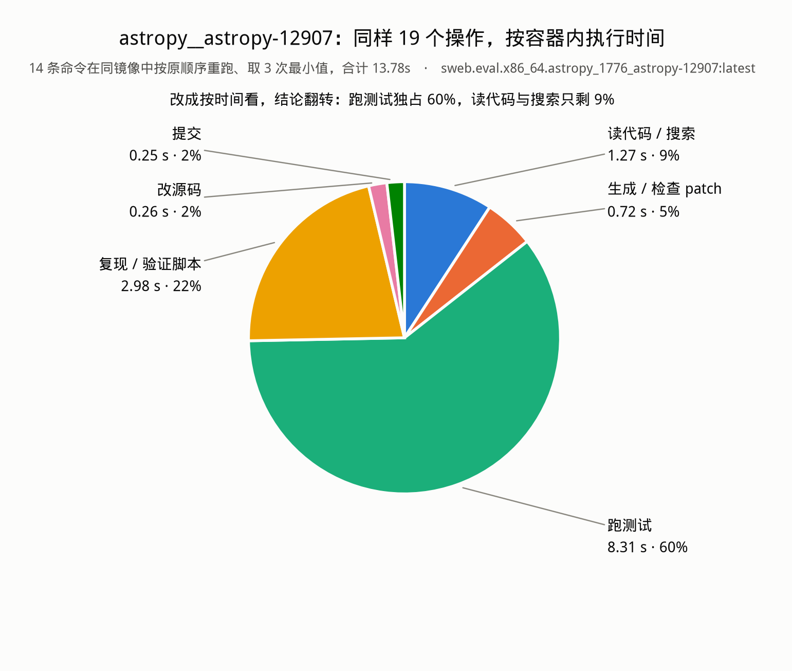
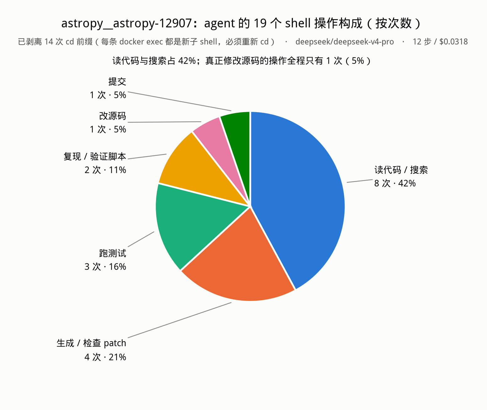

# `astropy__astropy-12907` 单次运行的操作统计（DeepSeek v4-pro 驱动 mini-SWE-agent）

- 数据集：`SWE-bench/SWE-bench_Verified` test split 第 1 条
- 模型：`deepseek/deepseek-v4-pro`（litellm → api.deepseek.com）
- 镜像：`docker.io/swebench/sweb.eval.x86_64.astropy_1776_astropy-12907:latest`
- 退出状态：`Submitted`

## 1. 宏观计数

| 指标 | 值 |
|---|---|
| LM 调用 / agent step | 12 |
| 消息总数 | 28（system 1 + user 1 + assistant 12 + tool 13 + exit 1） |
| **bash 工具调用** | **14** |
| 拆出的 shell 操作 | **33** = `cd` 前缀 14 + **真实操作 19** |
| 观察回灌总字节 | 23,750（单次最大 7,977 / 中位 791，无一触发 10,000 截断） |
| 输入 token 累计 | 102,926（其中缓存命中 93,312，**90.7%**） |
| 输出 token 累计 | 3,790（其中 reasoning 2,218） |
| 成本 | **$0.0318** |
| 提交 patch | 504 字符，1 文件 1 行 |

**为什么 14 次 bash 调用只对应 12 次 LM 调用**：配置开了 `parallel_tool_calls: true`，
第 2 步和第 4 步各在一次回复里发了 2 个 bash tool call。

**为什么 13 个 tool 观察对应 14 次调用**：第 14 次是提交命令，
`DockerEnvironment._check_finished()` 在拼观察消息之前就抛了 `Submitted`，所以没有第 14 条观察。

## 2. agent loop 的开销

### 2.1 整体

| 项 | 秒 | 占比 |
|---|---|---|
| 启动（**不在 loop 内**）：载数据集 | 11.3 | — |
| 启动：`docker run` 起容器（镜像已在本地） | 0.55 | — |
| **loop 墙钟总时长** | **67.9** | 100% |
| ├ LM 窗口合计 | 56.3 | **83%** |
| └ exec 窗口合计（docker exec 跑命令） | 11.6 | **17%** |
| 其中框架自身开销（每步 `save()` 序列化+写轨迹，实测） | 0.02 | 0.03% |

三点结论：

1. **时间几乎全花在等模型上（83%）**，容器里真正执行命令只占 17%。SWE-bench 的
   agent loop 是 IO-bound on the LLM，不是 compute-bound。
2. **框架本身几乎不花钱**。`DefaultAgent.run` 在每个 step 的 `finally` 里调 `save()`，
   把整个消息列表 json.dumps 后落盘（末轮约 1MB）。实测 12 步累计只有 0.02s，
   相对 67.9s 可以忽略。所以"agent loop 开销"实质上就是 **LM 延迟 + 命令执行时间**，
   没有隐藏的框架税。
3. **`cd` 前缀 14 次是纯粹的协议开销**：每条 `docker exec ... bash -c` 都是独立子 shell，
   `cd` 不跨命令保留，所以 14 次调用全部要重新 `cd /testbed`。它不产生任何信息，
   统计时必须剥掉，否则会占掉 42% 的"操作量"。

### 2.2 每个 step

`LM_s` = 上一步观察产生 → 本步模型回复到达（含 API 往返 + 消息组装 + 落盘）；
`exec_s` = 模型回复 → 本步全部命令跑完（一个 step 里的多个 action 是串行执行、统一打时间戳，
所以只能按 step 统计，不能拆到单条命令）。

| step | act | LM_s | exec_s | step_s | in_tok | Δin | cache% | out | reason | cost $ | obs_B |
|---:|---:|---:|---:|---:|---:|---:|---:|---:|---:|---:|---:|
| 1 | 1 | 2.16 | 0.28 | 2.44 | 1,768 | 1,768 | 0% | 119 | 26 | 0.00281 | 1,993 |
| 2 | 2 | 1.87 | 0.45 | 2.32 | 2,766 | 998 | 65% | 122 | 8 | 0.00185 | 9,887 |
| 3 | 1 | 1.38 | 0.23 | 1.61 | 5,580 | 2,814 | 50% | 63 | 0 | 0.00402 | 1,913 |
| 4 | 2 | **17.39** | 1.95 | **19.34** | 6,132 | 552 | 92% | **1,384** | **1,119** | **0.00639** | 5,121 |
| 5 | 1 | 5.10 | 0.27 | 5.38 | 9,154 | 3,022 | 81% | 367 | 133 | 0.00406 | 504 |
| 6 | 1 | 3.31 | 0.89 | 4.19 | 9,715 | 561 | 97% | 291 | 6 | 0.00189 | 791 |
| 7 | 1 | 2.43 | 2.45 | 4.89 | 10,236 | 521 | 98% | 132 | 14 | 0.00129 | 303 |
| 8 | 1 | 1.67 | 2.68 | 4.35 | 10,459 | 223 | 99% | 88 | 9 | 0.00092 | 1,909 |
| 9 | 1 | 0.89 | 1.76 | 2.64 | 11,079 | 620 | 95% | 119 | 21 | 0.00170 | 288 |
| 10 | 1 | 10.53 | 0.39 | 10.92 | 11,284 | 205 | 99% | 567 | 505 | 0.00293 | 537 |
| 11 | 1 | 8.26 | 0.22 | 8.48 | 12,054 | 770 | 98% | 451 | 369 | 0.00267 | 504 |
| 12 | 1 | 1.33 | n/a | 1.33 | 12,699 | 645 | 98% | 87 | 8 | 0.00126 | 0 |

读这张表：

- **step 时长由 reasoning token 决定，不由命令决定。** 最贵的 step 4（19.3s）花了 1,119 个
  reasoning token——那是模型第一次看完源码和复现输出、要想清楚 bug 在哪的时刻。
  step 10、11（10.5s / 8.3s）同理，是在决定"那个失败要不要管"和"patch 该怎么切"。
  相比之下 exec 最慢的 step 7、8（2.45s / 2.68s）不过是 pytest 在跑。
- **上下文单调增长，累计输入是末轮上下文的 8.1 倍**（102,926 / 12,699）。
  每一步都要重发全部历史，这是 agent loop 最本质的成本结构：
  **成本随步数近似平方增长**，而不是线性。
- **缓存救了这个结构。** 缓存命中率从 step 1 的 0% 一路爬到后期的 95–99%，整体 90.7%。
  两次明显回落（step 3 的 50%、step 5 的 81%）都发生在上一步刚灌进大块观察之后
  （step 2 回灌了 9,887 字节、step 4 回灌了 5,121 字节）——新增前缀越长，命中率掉得越多。
  这也解释了为什么 step 3 只输出 63 个 token 却要 $0.004，比输出 291 个 token 的 step 6 还贵。
- **观察被压得很小**（总共 23,750 字节），因为模型主动用 `sed -n` 分段读、`| head` 截流。
  如果它 `cat` 整个 separable.py，单次观察就会超过 10,000 触发截断，还会把后面每一步的
  输入 token 全部抬高。

### 2.3 只看执行时间：逐条命令

轨迹只能把执行时间统计到 step（mini 是把一个 step 的所有 action 跑完才统一打时间戳，
实测同 step 两条 tool 消息只差 3ms）。要精确到每条命令，就把 14 条命令在同一镜像里
按原顺序重跑一遍逐条计时（`measure_exec.py`，取 3 遍最小值）——顺序重放也复现了状态演进：
第 7 条的改源码发生在三次 pytest 之前，所以那三次 pytest 跑的是打过 patch 的树，和 agent 当时看到的一致。

| # | 秒 | 占比 | rc | 命令（已剥 cd） |
|---:|---:|---:|---:|---|
| 1 | 0.294 | 2.1% | 0 | `ls -la` + `find … \| head -20` |
| 2 | 0.240 | 1.7% | 0 | `sed -n '1,260p' separable.py` |
| 3 | 0.258 | 1.9% | 0 | `grep -R "separability_matrix" -n … \| head -50` |
| 4 | 0.256 | 1.9% | 0 | `sed -n '260,380p' separable.py` |
| 5 | **1.954** | **14.2%** | 0 | `python - <<'PY'` 复现（import astropy） |
| 6 | 0.220 | 1.6% | 0 | `sed -n '1,220p' test_separable.py` |
| 7 | 0.260 | 1.9% | 0 | `python - <<'PY'` **改源码** + `git diff` |
| 8 | 1.023 | 7.4% | 0 | `python - <<'PY'` 边界验证（6 种组合） |
| 9 | **3.070** | **22.3%** | 0 | `pytest -q 两个文件 -k 'separable…' --maxfail=1` |
| 10 | **3.340** | **24.2%** | 1 | `pytest -q 两个文件 --maxfail=1` |
| 11 | **1.896** | **13.8%** | 0 | `pytest -q test_separable.py --maxfail=1` |
| 12 | 0.476 | 3.5% | 0 | `git status --short` + `git diff` |
| 13 | 0.241 | 1.7% | 0 | `git diff > patch.txt` + `cat patch.txt` |
| 14 | 0.249 | 1.8% | 0 | `echo COMPLETE_TASK_…` + `cat patch.txt` |
| | **13.78** | 100% | | |

和轨迹里按 step 量出来的 exec 窗口对照（形状一致，重放整体高约 17%，差异集中在三次 pytest，
大概率是原始运行时 page cache 更热）：

| step | 轨迹 exec_s | 重放对应命令 | 重放合计 |
|---:|---:|---|---:|
| 1 | 0.28 | #1 | 0.294 |
| 2 | 0.45 | #2 + #3 | 0.498 |
| 3 | 0.23 | #4 | 0.256 |
| 4 | 1.95 | #5 + #6 | 2.174 |
| 5 | 0.27 | #7 | 0.260 |
| 6 | 0.89 | #8 | 1.023 |
| 7 | 2.45 | #9 | 3.070 |
| 8 | 2.68 | #10 | 3.340 |
| 9 | 1.76 | #11 | 1.896 |
| 10 | 0.39 | #12 | 0.476 |
| 11 | 0.22 | #13 | 0.241 |
| 12 | **测不到**（提交命令抛 `Submitted`，观察消息没生成） | #14 | 0.249 |

**换成时间口径，结论整个翻转：**



| 阶段 | 按次数 | 按执行时间 |
|---|---:|---:|
| 跑测试 | 3 次 · 16% | **8.31 s · 60%** |
| 复现 / 验证脚本 | 2 次 · 11% | 2.98 s · 22% |
| 读代码 / 搜索 | **8 次 · 42%** | 1.27 s · **9%** |
| 生成 / 检查 patch | 4 次 · 21% | 0.72 s · 5% |
| 改源码 | 1 次 · 5% | 0.26 s · 2% |
| 提交 | 1 次 · 5% | 0.25 s · 2% |

三点：

- **按次数最多的动作（读和搜，42%）几乎不花执行时间（9%）。** `sed -n`、`grep | head`
  这类操作每条 0.22–0.29s，其中大部分还是 `docker exec` 本身的固定开销，而不是命令在算。
- **时间全被 pytest 吃掉（60%）。** 三次 pytest 8.31s；范围最宽的 #10（两个测试文件全跑）
  最贵，3.34s。模型用 `--maxfail=1`、`-q`、`--disable-warnings` 压时间和输出，是有意义的。
- **同样是 `python - <<'PY'`，差了 7.5 倍**：#5 复现脚本 1.954s（要 `import astropy`），
  #7 改源码只要 0.260s（只用 `pathlib` 读写文本，不导入被测包）。
  这也解释了为什么"用 Python heredoc 改文件"并不慢——慢的从来不是编辑，是导入和跑测试。

放回整个 loop 看：执行时间总共只有 11.6s（轨迹口径），占 loop 墙钟 67.9s 的 17%。
就算是独占执行时间 60% 的 pytest，摊到整个 loop 也只有 12%。**agent 的时间不在容器里，在等模型。**

## 3. bash 内部到底做了什么（已剥离 cd 前缀，19 个真实操作）



按工作阶段归并（饼图的 6 个扇区）：

| 阶段 | 次数 | 占比 | 含哪些 |
|---|---:|---:|---|
| 读代码 / 搜索 | 8 | 42.1% | `read_file` 5 + `list_dir` 1 + `search_files` 1 + `search_content` 1 |
| 生成 / 检查 patch | 4 | 21.1% | `make_patch` 3 + `vcs` 1 |
| 跑测试 | 3 | 15.8% | `run_tests` 3 |
| 复现 / 验证脚本 | 2 | 10.5% | `repro_script` 2 |
| 改源码 | 1 | 5.3% | `edit_file` 1 |
| 提交 | 1 | 5.3% | `submit` 1 |

原始 10 类意图明细（饼图不直接画 10 类：6 个类别都只有 1 次、各占 5.3%，
画成 10 个扇区里 6 个一模一样的细条，反而看不出东西）：

| 意图 | 次数 | 说明 |
|---|---:|---|
| `read_file` | 5 | `sed -n 'a,bp'`（3）、`cat patch.txt`（2） |
| `make_patch` | 3 | `git diff -- <file>`，其中 1 次重定向到 patch.txt |
| `run_tests` | 3 | 3 次 pytest |
| `repro_script` | 2 | `python - <<'PY'` 只打印不写盘（#5 复现、#8 边界验证） |
| `list_dir` | 1 | `ls -la` |
| `search_files` | 1 | `find . -maxdepth 3 -name 'separable.py' ...` |
| `search_content` | 1 | `grep -R "separability_matrix" -n astropy/modeling` |
| `edit_file` | 1 | **全程只有这一次真正改了源码**（#7 的 `python - <<'PY'` + `write_text`） |
| `vcs` | 1 | `git status --short` |
| `submit` | 1 | `echo COMPLETE_TASK_AND_SUBMIT_FINAL_OUTPUT` |

**另计：`cd` 前缀 14 次，目标全部是 `/testbed`。** 不计入上表——它是子 shell 协议的开销，不是工作。

按实际调用的**程序**统计（`cd` 已剥离，管道每段各计一次）：

`git`×4、`sed`×3、`python`×3、`pytest`×3、`head`×2、`cat`×2、`ls`×1、`find`×1、`grep`×1、`echo`×1

被引用的文件：`astropy/modeling/separable.py`(6)、`astropy/modeling/tests/test_separable.py`(4)、
`patch.txt`(3)、`astropy/modeling/tests/test_core.py`(2)。

返回码：`rc=0` 12 次，`rc=1` 1 次，`rc=None`（提交，无观察）1 次。

一句话概括这张饼图：**42% 的操作只是在读和搜，真正动源码的只有 1 次（5%）。**
这正是 SWE-bench 这类任务的形状——定位比修改难得多。

## 4. 逐步剖析：bash 内部的真实语义

### 阶段 A｜定位（#1–#4，4 次调用，0 次写操作）
```bash
cd /testbed && ls -la && find . -maxdepth 3 -name 'separable.py' -o -name 'separable*.py' | head -20
cd /testbed && sed -n '1,260p' astropy/modeling/separable.py          # 读前 260 行
cd /testbed && grep -R "separability_matrix" -n astropy/modeling | head -50
cd /testbed && sed -n '260,380p' astropy/modeling/separable.py        # 接着读 260-380 行
```
要点：
- 用 `sed -n 'a,bp'` 分段读而不是 `cat` 整个文件 —— prompt 的观察模板对 >10000 字符会截断，
  分段读是对这个限制的直接适应。最大一次观察 7,977 字节，正好压在阈值下。
- `grep -R ... | head -50` 主动截流。
- `find ... -name 'separable.py' -o -name 'separable*.py'` 两个模式是冗余的
  （后者完全包含前者），`-o` 分支没有意义但无害。`-maxdepth` 是 find 的全局选项，
  对两个分支同时生效（已实测确认），所以不存在深度约束漏掉半支的问题。

### 阶段 B｜复现（#5，`repro_script`：只打印，不落盘）
```bash
cd /testbed && python - <<'PY'
from astropy.modeling import models as m
from astropy.modeling.separable import separability_matrix
cm = m.Linear1D(10) & m.Linear1D(5)
print(separability_matrix(cm))
print(separability_matrix(m.Pix2Sky_TAN() & m.Linear1D(10) & m.Linear1D(5)))
print(separability_matrix(m.Pix2Sky_TAN() & cm))
print(repr(m.Pix2Sky_TAN() & cm))
PY
```
- **完全照抄 issue 正文里的三段代码**，第四行 `repr(...)` 是自己加的，用来看嵌套模型的实际结构。
- 用 `python - <<'PY'` 而不是先 `cat > repro.py` 再 `python repro.py`：不落盘，
  也就不会污染最后的 `git diff`。prompt 明确禁止把复现脚本提交进 patch，这种写法天然规避。
- 这次是全程最慢的一轮（LM 侧 17.6s，因为模型在这轮花了 1,119 个 reasoning token）。

### 阶段 C｜改代码（#7，核心动作）
```bash
cd /testbed && python - <<'PY'
from pathlib import Path
p = Path('astropy/modeling/separable.py')
s = p.read_text()
old = "        cright = np.zeros((noutp, right.shape[1]))\n        cright[-right.shape[0]:, -right.shape[1]:] = 1\n"
new = "        cright = np.zeros((noutp, right.shape[1]))\n        cright[-right.shape[0]:, -right.shape[1]:] = right\n"
assert old in s
p.write_text(s.replace(old, new))
PY
git diff -- astropy/modeling/separable.py
```
这一条命令里藏着四个值得注意的工程细节：
1. **用 Python 而不是 `sed -i` 改文件**。目标行含 `[`、`]`、`:`、`-`，sed 正则要转义得很难看；
   Python 的字面量替换没有转义问题。
2. **带 2 行上下文的锚点**：`old` 串包含上一行 `cright = np.zeros(...)`，避免误伤同名模式。
3. **`assert old in s`**：替换前先断言锚点存在。如果文件内容和预期不符，脚本非零退出，
   模型会在观察里看到 AssertionError 而不是"命令成功但什么都没改"。这是 heredoc 编辑里最关键的一句。
4. **同一次 tool call 里紧跟 `git diff` 自检** —— 一次往返就同时完成"改"和"确认改对了"。

产出的 diff 与 gold patch 的**代码改动完全相同**（同一 hunk、同一行）。
文本上并非逐字符相同：模型的 patch 多一行 `index a308e2729..45bea3608 100755`，
因为 `git diff` 默认会输出 blob 哈希行，而数据集里的 gold patch 把它剥掉了（470B vs 504B）。
这一行对 `git apply` 无影响，评测照常通过。

### 阶段 D｜验证（#8–#11）
```bash
# #8 扩展复现：加了 is_separable、左嵌套、双层嵌套共 6 种组合
cd /testbed && python - <<'PY' ... PY
# #9 先跑窄范围
cd /testbed && pytest -q astropy/modeling/tests/test_separable.py astropy/modeling/tests/test_core.py \
      -k 'separable or separability' --disable-warnings --maxfail=1        # rc=0
# #10 再跑宽范围
cd /testbed && pytest -q astropy/modeling/tests/test_separable.py astropy/modeling/tests/test_core.py \
      --disable-warnings --maxfail=1                                        # rc=1  ← 唯一一次失败
# #11 收窄回来确认
cd /testbed && pytest -q astropy/modeling/tests/test_separable.py --disable-warnings --maxfail=1   # rc=0
```
- #8 是**自己扩展的边界测试**（`cm & Pix2Sky_TAN()` 左嵌套、`Linear1D & (Pix2Sky_TAN & cm)` 双层嵌套），
  prompt 的 "Test edge cases" 那一步确实被执行了。
- #10 的 `rc=1` 是 `test_core.py::test_prepare_outputs_single_entry_vector` 失败，
  原因是浮点最后一位不等（`Max absolute difference: 1.11e-16`），**与本次改动无关**（预先存在的环境噪声）。
  模型在下一轮明确写下 "The only failure in the broader test is an unrelated floating-point precision mismatch"，
  然后收窄范围重跑 —— 没有为了让测试变绿去动 `test_core.py`。这一点很关键：改测试会被评测脚本的
  `git checkout <base> <test_file>` 冲掉，而且会破坏 P2P。
- `--maxfail=1` 让失败早停，省 token；`-q --disable-warnings` 压缩输出。

### 阶段 E｜提交（#12–#14，严格三步）
```bash
cd /testbed && git status --short && git diff -- astropy/modeling/separable.py   # 确认工作区只有这一个改动
cd /testbed && git diff -- astropy/modeling/separable.py > patch.txt && cat patch.txt   # 生成并核对
cd /testbed && echo COMPLETE_TASK_AND_SUBMIT_FINAL_OUTPUT && cat patch.txt              # 提交
```
- `git status --short` 确认没有多余的新建文件（因为复现脚本走的 stdin，工作区确实干净）。
- 第三条的输出首行恰为 `COMPLETE_TASK_AND_SUBMIT_FINAL_OUTPUT` 且 rc=0，
  `DockerEnvironment._check_finished()` 抛 `Submitted`，其余行（即 patch.txt 内容）成为 `submission`。
- `patch.txt` 虽然写进了 `/testbed`，但 `git diff -- <path>` 限定了路径，所以它不会进 patch。

## 5. 从 bash 视角能看出的行为模式

1. **每条命令都以 `cd /testbed &&` 开头**（14/14）。这不是冗余，是被 `bash -c` 无状态子 shell 逼出来的。
2. **读文件全部用范围读**（`sed -n`、`| head -50`），没有一次无界 `cat` 源码文件 —— 对观察截断阈值的适应。
3. **写文件全部用 `python - <<'PY'` heredoc**，不用 `sed -i`，且都带 `assert` 前置校验。
4. **每次修改后立刻 `git diff` 自检**，把"修改"和"验证修改"塞进同一次往返，省一轮 LM 调用。
5. **不落盘的复现脚本**：`python - <<'PY'` 而非 `cat > repro.py`，从源头保证最终 diff 干净。
6. **测试范围先窄后宽再窄**：定位噪声、确认无关、收敛结论，全程没有动测试文件。
7. **成本结构全在输入侧**：102,926 in vs 3,790 out。每轮重发全部历史，累计输入是末轮上下文的
   8.1 倍，所以成本随步数近似平方增长。真正把账单压下来的是 prompt 缓存（整体命中 90.7%）——
   而缓存命中率又取决于上一步回灌了多大的观察，这就把"少产出输出、把观察压小"变成了直接的省钱手段。
